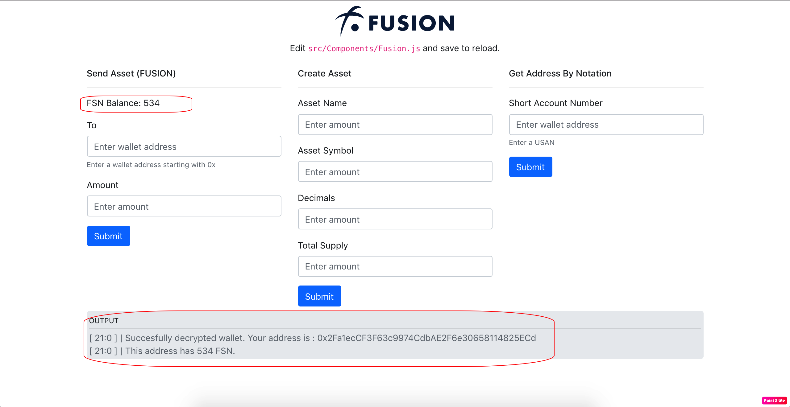

# Fusion Boilerplate react sample

In this app, we will go through steps to deploy Fusion Boilerplate react sample on Morpheuslabs BaaS platform.

Morpheuslabs platform provide great system to create a ready blockchain development with few clicks.

Now, we firstly create a workspace with all thing setup to start develop

## Step 1. Register new account in `https://bps.morpheuslabs.io`

2. Goto Membership tab click and subscribe try plan

3. Update use profile and finish subscribe

## Step 2: Download Fusion sample from app library.

Next we will download app from app library to run on workspace. Before you are able to download app, you need a gitlab or github repo to link with your account
1. Goto `https://gitlab.com` or `https://github.com` and register new account if you do not have it yet. More info about My Repository configuration <a href="https://docs.morpheuslabs.io/docs/configuration">here</a>
2. Goto your setting and create new access token:

`https://docs.gitlab.com/ee/user/profile/personal_access_tokens.html`

3. Copy it and paste access token to repository setting and connect

Wait a minute for workspace to connect with your git repo

4. Goto Application Library tab

5. Click on download icon of Fussion boilerplate Sample and download app

6. After app is downloaded, click on deploy button and enter workspace name to deploy

Wait little for deploying app, after app is deployed, let start it by click on start icon

8. Open workspace you can see app folder is aready is setup in your workspace

So now, we have ready a development env to develop dApp

# Step 3. Create Fusion blockchain ops

Next, go to Blockchain Ops tab and click New BlockChain button

2. Select Fusion as your blockchain Ops and enter name

3. Choose Ready to Go for basic setup, or Advance for more customize options, but we select basic setup for now.

4. Enter prefix as icon and password to create blockchain ops

5. Wait a while for creating and click start ico to start node

6. Click on (i) icon to get following information, we will need it later.
    - External API URL
    - External WSS URL

7. Enter your password and click Retrieve button to get genesis address and privatekey miner address with fusion in it.

NOTE: Important note, when you just start up blockchain network, it will take sometime to load DAG file to start generating block, click on Explorer URL and wait until to see at least 5 block before starting app to run.

# Step 4. Install dependencies and start app

1. Goto sample folder
`cd fusion-boilerplate-react`

2. Run `npm install`

3. Config application, open file `/src/component/Fusion.js`, Network and chainId.
    - _NETWORK is 'External WS URL' you get before
    - And ChainID is 'Network Id'
    
    

4. Run dev server `npm start`
5. Open workspace information to get public URL server

6. Click on http-server link to view dapp, If you see this screen, it means everything is setup correctly

7. Enter private key you get from blockchain ops and click Decrypt to view wallet, you can see current FSB balance in wallet and log as below:
